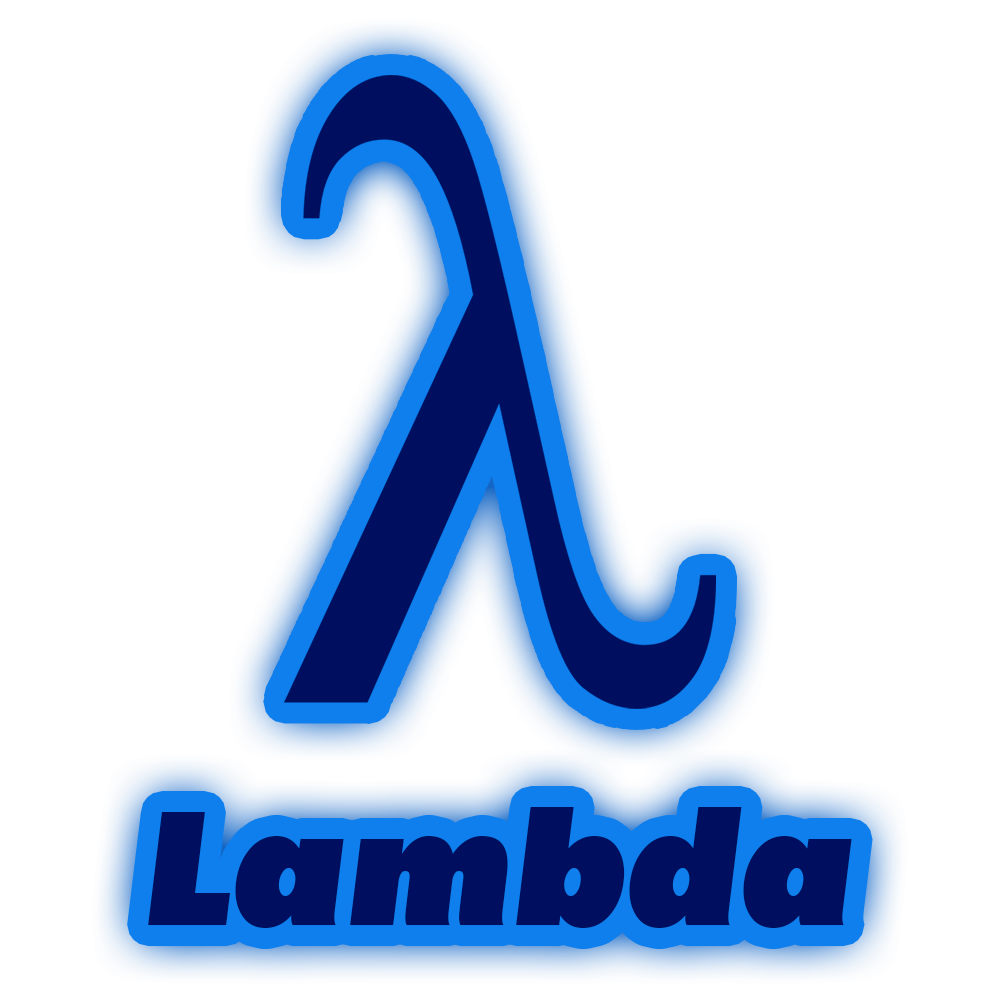

<p align="center">
 <br>
Experimenting with pure lambda calculus using simple language
</p>

Lambda - is a small and simple language to experiment with a some basic lambda calculus. What it does is it basically performs beta-reduction and alpha-conversion to evaluate the result of expressions.

Example of some basic combinators implementation in Lambda:

```
let m = lambda f -> f f
let k = lambda a b -> a
let ki = k i
let c = lambda f a b -> f b a

let true = k
let false = ki

let not = \p -> p false true
let and = \a b -> a b false
let or = λa b -> a true b
```

> Note that `lambda`, `\` and `λ` are actually same symbols which are just different ways to define a lambda.